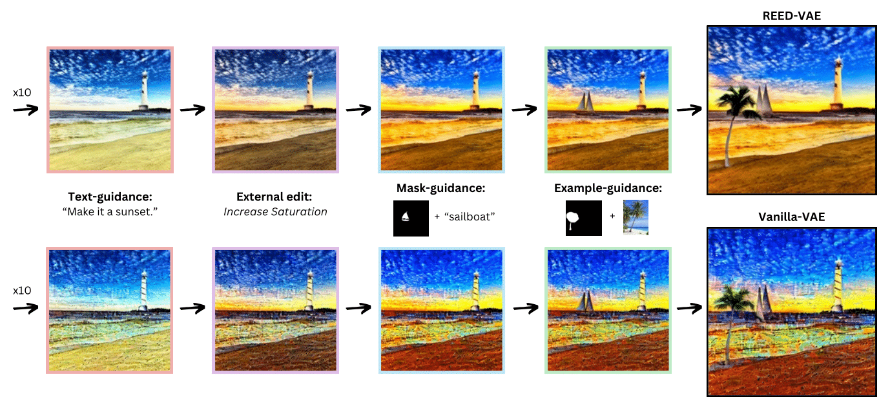

# REED-VAE: RE-Encode Decode Training for Iterative Image Editing with Diffusion Models

> <a href="https://reed-vae.github.io/">**REED-VAE: RE-Encode Decode Training for Iterative Image Editing with Diffusion Models**</a>
>
> Gal Almog, Ariel Shamir, Ohad Fried
>
> Abstract: While latent diffusion models achieve impressive image editing results, their application to iterative editing of the same image is severely restricted. When trying to apply consecutive edit operations using current models, they accumulate artifacts and noise due to repeated transitions between pixel and latent spaces. Some methods have attempted to address this limitation by performing the entire edit chain within the latent space, sacrificing flexibility by supporting only a limited, predetermined set of diffusion editing operations. We present a re-encode decode (REED) training scheme for variational autoencoders (VAEs), which promotes image quality preservation even after many iterations. Our work enables multi-method iterative image editing: users can perform a variety of iterative edit operations, with each operation building on the output of the previous one using both diffusion based operations and conventional editing techniques. We demonstrate the advantage of REED-VAE across a range of image editing scenarios, including text-based and mask-based editing frameworks. In addition, we show how REED-VAE enhances the overall editability of images, increasing the likelihood of successful and precise edit operations. We hope that this work will serve as a benchmark for the newly introduced task of multi-method image editing.

      
     
    REED-VAE introduces a novel training scheme for variational autoencoders (VAEs) that is designed to be robust and efficient for iterative image editing with diffusion models. By learning a more effective latent space representation, REED-VAE enables better control over the editing process while maintaining high fidelity to the original image.

Code and models will be released soon!